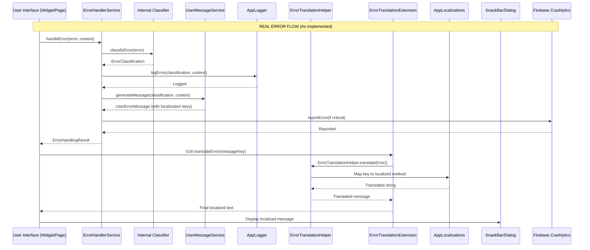
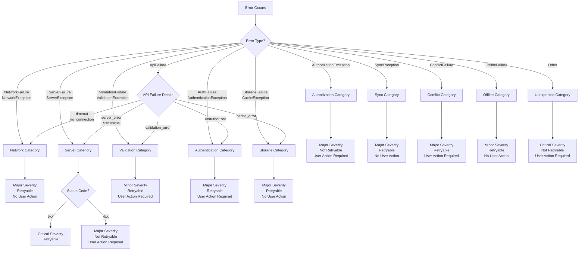
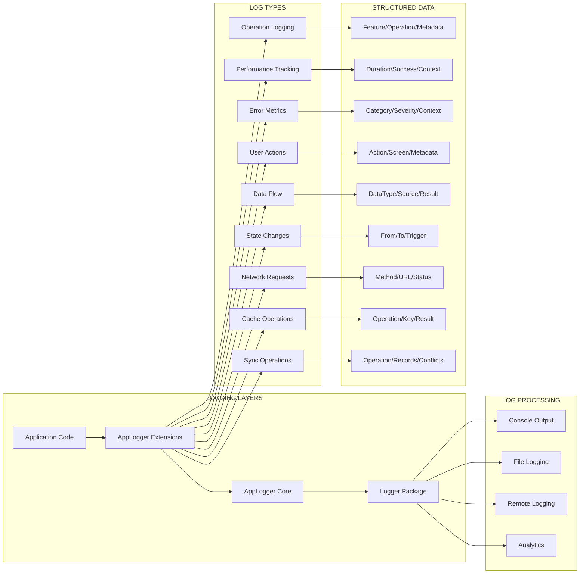

# Error Handling Architecture Diagram
## Visual System Architecture

```mermaid
graph TB
    subgraph "PRESENTATION LAYER"
        A[Widget/Page] --> AA[Direct Error Display]
        A --> AB[ScaffoldMessenger.showSnackBar]
        A --> AC[Dialog/Alert]
        D[StateNotifier/Provider] --> E[AsyncValue.handleError]
        F[Form Validation] --> G[User Input Validation]

        subgraph "UNUSED COMPONENTS (Available but not used)"
            B[ErrorBoundaryWidget]
            C[FeatureErrorBoundary]
        end
    end

    subgraph "ERROR HANDLING CORE"
        H[ErrorHandlerService] --> I[ErrorClassification]
        H --> J[UserMessageService]
        H --> K[AppLogger Extensions]
        H --> L[PerformanceTracker]

        I --> M{Error Category}
        M -->|Network| N[Network Strategies]
        M -->|Server| O[Server Error Handling]
        M -->|Validation| P[Validation Processing]
        M -->|Auth| Q[Authentication Flow]
        M -->|Storage| R[Storage Fallbacks]

        J --> S[Localization Keys: titleKey, messageKey]
        J --> T[Contextual Messaging]
        J --> U[Actionable Steps]
    end

    subgraph "ERROR TRANSLATION SYSTEM"
        ETH[ErrorTranslationHelper] --> ETE[ErrorTranslationExtension]
        ETH --> ETM[Error Key Mapping]
        ETE --> AL[AppLocalizations Methods]
        ETM --> ETL{Error Translation Logic}
        ETL -->|errorServerMessage| ESM[l10n.errorServerMessage]
        ETL -->|errorNetworkMessage| ENM[l10n.errorNetworkMessage]
        ETL -->|errorAuthMessage| EAM[l10n.errorAuthMessage]
        ETL -->|errorValidationMessage| EVM[l10n.errorValidationMessage]
        ETL -->|Not recognized| FBK[Return as-is fallback]
    end

    subgraph "DOMAIN LAYER"
        V[Use Cases] --> W[Input Validation]
        V --> X[Business Logic]
        V --> Y[Repository Calls]
        W --> H
        Y --> H
    end

    subgraph "DATA LAYER"
        Z[Repository Implementation] --> AA[Remote DataSource]
        Z --> BB[Local DataSource]
        Z --> CC[Network Info]
        AA --> H
        BB --> H
        CC --> H
    end

    subgraph "LOGGING SYSTEM"
        K --> DD[Structured Logging]
        K --> EE[Performance Metrics]
        K --> FF[Error Analytics]
        K --> GG[Debug Information]
        
        DD --> HH[Feature Logging]
        DD --> II[Operation Logging]
        DD --> JJ[Data Flow Logging]
        DD --> KK[State Change Logging]
    end

    subgraph "USER EXPERIENCE"
        B --> LL[Error UI Components]
        S --> ETH[ErrorTranslationHelper]
        ETH --> MM[SnackBar Messages]
        ETH --> NN[Error Dialogs]
        J --> OO[Retry Mechanisms]
        J --> PP[Recovery Actions]
    end

    subgraph "EXTERNAL SERVICES"
        H --> QQ[Error Reporting Service]
        H --> RR[Analytics Service]
        K --> SS[Remote Logging]
    end

    %% Connections - REAL FLOW
    A -.-> H
    D -.-> H
    AA -.-> ETH
    AB -.-> ETH
    AC -.-> ETH
    E -.-> ETH
    V -.-> H
    Z -.-> H
    S -.-> ETH
    ETH -.-> ETE
    ETE -.-> AL

    %% Unused connections (dashed)
    B -.-> J
    C -.-> J
```



## Error Flow Sequence



## Error Classification Decision Tree



## Logging Strategy Architecture



## Implementation Layers

### Presentation Layer
- **Direct Error Display**: Widgets call ErrorHandlerService directly and display results
- **Error Translation**: ErrorTranslationExtension provides l10n.translateError() convenience method
- **SnackBar/Dialog Messages**: UI components show localized error messages via translation system
- **AsyncValue Extensions**: Provider error handling with ErrorHandlerService integration
- **Form Validation**: Input validation with logging
- **ErrorBoundaryWidget**: Available but unused - could catch widget tree errors
- **FeatureErrorBoundary**: Available but unused - could provide feature-specific error handling

### Domain Layer  
- **Use Case Error Patterns**: Comprehensive validation and error handling
- **Business Rule Validation**: Domain-specific validation logic
- **Repository Abstraction**: Error handling contracts

### Data Layer
- **Repository Error Handling**: Network/cache fallback strategies
- **DataSource Error Mapping**: Exception to Failure mapping
- **Retry Logic**: Intelligent retry strategies

### Core Services
- **ErrorHandlerService**: Central error processing
- **UserMessageService**: User-friendly message generation with localization keys
- **ErrorTranslationHelper**: Central translation logic mapping error keys to localized strings
- **ErrorTranslationExtension**: UI convenience methods for error translation
- **AppLogger Extensions**: Structured logging system
- **Performance Tracking**: Operation performance monitoring

## Key Features

### 1. **Comprehensive Error Classification**
- 12 distinct error categories
- 6 severity levels
- Retryability assessment
- User action requirements

### 2. **User-Friendly Messaging**
- Centralized error translation system
- Localized error messages (EN/FR) via ErrorTranslationHelper
- Context-aware messaging
- Actionable recovery steps
- Retry mechanisms
- Convenient UI integration via ErrorTranslationExtension

### 3. **Structured Logging**
- Feature-based logging
- Operation tracking
- Performance metrics
- Debug information

### 4. **Clean Architecture Compliance**
- Layer-appropriate error handling
- Dependency inversion
- Single responsibility
- Interface segregation

### 5. **Production-Ready Features**
- Error reporting integration
- Analytics tracking
- Performance monitoring
- Memory leak prevention

This architecture transforms silent failures into a robust, debuggable, and user-friendly error handling system with centralized translation management while maintaining Clean Architecture principles.

## Error Translation Usage Examples

### UI Component Usage
```dart
// In any widget that displays errors
class FamilyErrorWidget extends ConsumerWidget {
  @override
  Widget build(BuildContext context, WidgetRef ref) {
    final l10n = AppLocalizations.of(context);
    final errorState = ref.watch(familyProvider);

    if (errorState.hasError) {
      // Simple translation - handles both keys and raw messages
      final errorMessage = l10n.translateError(errorState.error.toString());

      return Text(errorMessage);
    }

    return Container();
  }
}
```

### Provider Error Handling
```dart
class FamilyNotifier extends StateNotifier<AsyncValue<List<Family>>> {
  Future<void> loadFamilies() async {
    try {
      final result = await familyRepository.getFamilies();
      result.when(
        ok: (families) => state = AsyncValue.data(families),
        err: (failure) {
          // ErrorHandlerService generates UserErrorMessage with localization keys
          final errorResult = await errorHandler.handleError(failure, context);
          state = AsyncValue.error(errorResult.userMessage.messageKey, StackTrace.current);
        },
      );
    } catch (e, stackTrace) {
      state = AsyncValue.error('errorSystemMessage', stackTrace);
    }
  }
}
```

### Translation Extension Benefits
- **Consistency**: All error translations go through ErrorTranslationHelper
- **Convenience**: Simple l10n.translateError() method for UI components
- **Flexibility**: Handles both localization keys and already translated messages
- **Maintainability**: Centralized translation logic for easy updates
- **Type Safety**: Compile-time verification of translation methods