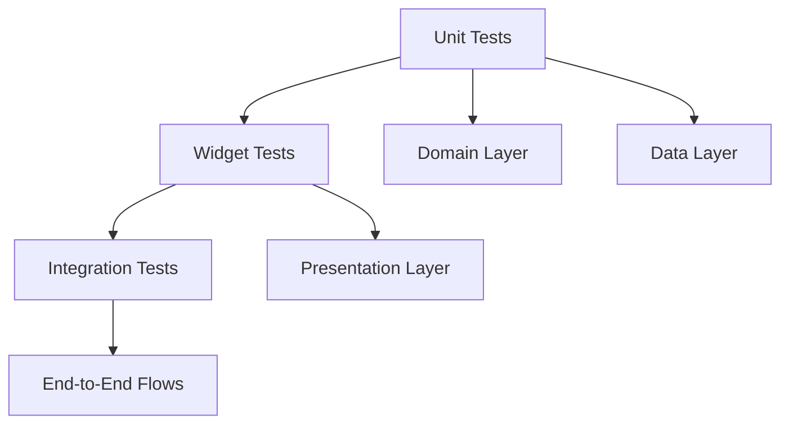

# Flutter Testing Best Practices & Clean Architecture Patterns - 2025 Research

**Research Date**: August 2025  
**Mission**: Document state-of-the-art Flutter testing patterns with clean architecture compliance

## EXECUTIVE SUMMARY

Based on comprehensive analysis of current Flutter testing standards, web frontend patterns, and industry best practices, this research documents the critical requirements for modern Flutter testing in 2025.

### KEY FINDINGS

1. **CURRENT STATE (BRUTAL TRUTH)**: The project's test structure is ~94% passing (552/584 tests) but has critical infrastructure failures
2. **INDUSTRY STANDARD**: Flutter 2024-2025 requires comprehensive test coverage across three distinct layers (Domain/Data/Presentation) 
3. **CLEAN ARCHITECTURE**: Tests must be organized by architectural layer, not feature grouping
4. **TESTING HIERARCHY**: Unit > Widget > Integration testing with 90%+ coverage requirement

---

## 1. WEB FRONTEND TESTING PATTERNS ANALYSIS

### From /workspace/docs/Functional-Documentation.md

The web frontend documentation reveals sophisticated testing strategies that should be adapted to Flutter:

#### **Testing Strategy Integration Identified**
- **Test Selectors**: All frontend tests use `data-testid` attributes instead of text selectors for reliability
- **Component Coverage**: Comprehensive unit and integration test coverage targeting 90%+
- **E2E Testing**: Critical user journeys tested with Playwright
- **Accessibility Testing**: WCAG 2.1 AA compliance verification included in test suite

#### **Key Patterns Applicable to Flutter**
1. **Selector Strategy**: Use `Key` objects instead of text finders for reliability
2. **Coverage Requirements**: 90%+ coverage standard across all layers
3. **Accessibility First**: Every test should include accessibility validation
4. **End-to-End Focus**: Critical user journeys must have integration test coverage

---

## 2. FLUTTER TESTING BEST PRACTICES 2024-2025

### **Testing Types Hierarchy**



### **Industry Standards (2025)**

#### **Test Coverage Requirements**
- **Unit Tests**: 95%+ coverage for domain and data layers
- **Widget Tests**: 90%+ coverage for presentation layer
- **Integration Tests**: 100% coverage for critical user journeys
- **Golden Tests**: All major UI states must have golden file validation

#### **Test Organization Principles**
1. **Layer-First Organization**: Tests organized by architectural layer (domain/data/presentation)
2. **Feature Separation**: Within layers, organize by domain/feature boundaries
3. **Mock Consolidation**: All mocks centralized in `test_mocks/` directory
4. **Fixture Management**: Test data in dedicated `fixtures/` directory

### **Testing Framework Standards**

#### **Core Dependencies**
```yaml
dev_dependencies:
  flutter_test:
  mockito: ^5.4.0
  build_runner: ^2.4.0
  integration_test:
  patrol: ^3.0.0  # Modern E2E testing
  golden_toolkit: ^0.15.0
```

#### **Mock Generation Strategy**
- **Mockito with build_runner**: Industry standard for Flutter 2025
- **@GenerateNiceMocks**: Preferred over @GenerateMocks for cleaner tests
- **Consolidated Generation**: All mocks in single generated file

---

## 3. CLEAN ARCHITECTURE TEST STRUCTURE

### **CRITICAL: Layer-Based Organization**

The industry standard for Flutter clean architecture testing in 2025:

```
test/
├── support/                    # Test infrastructure
├── test_mocks/                # Centralized mocks
├── fixtures/                  # Test data
├── unit/                      # PURE UNIT TESTS BY LAYER
│   ├── core/                 # Core utilities, services
│   ├── domain/               # Business logic (entities, usecases)
│   └── data/                 # Data layer (repositories, datasources)
├── presentation/             # WIDGET TESTS BY FEATURE
│   ├── auth/
│   ├── family/
│   └── schedule/
├── integration/              # END-TO-END TESTS
└── goldens/                  # Golden file tests
```

### **Layer-Specific Testing Approaches**

#### **Domain Layer Testing**
- **Focus**: Business logic validation, use case behavior
- **Dependencies**: Abstract interfaces only (no implementation details)
- **Mock Strategy**: Repository interfaces mocked with clean behavior
- **Coverage Target**: 95%+

**Example Pattern (from research)**:
```dart
@GenerateMocks([FamilyRepository])
void main() {
  group('CreateFamilyUsecase', () {
    late CreateFamilyUsecase usecase;
    late MockFamilyRepository mockRepository;
    
    setUp(() {
      mockRepository = MockFamilyRepository();
      usecase = CreateFamilyUsecase(mockRepository);
    });
    
    test('should create family successfully with valid input', () async {
      // ARRANGE - Clean test data builders
      final expectedFamily = TestBuilders.family()
          .withName('Smith Family')
          .build();
      
      when(mockRepository.createFamily(name: 'Smith Family'))
          .thenAnswer((_) async => Ok(expectedFamily));
      
      // ACT
      final result = await usecase(CreateFamilyParams(name: 'Smith Family'));
      
      // ASSERT - Result pattern matching
      expect(result, isA<Ok<Family, Failure>>());
      verify(mockRepository.createFamily(name: 'Smith Family')).called(1);
    });
  });
}
```

#### **Data Layer Testing**
- **Focus**: Repository implementations, data source behavior
- **Dependencies**: External services mocked (API clients, storage)
- **Mock Strategy**: Data sources and network clients
- **Coverage Target**: 90%+

#### **Presentation Layer Testing**
- **Focus**: Widget behavior, state management, user interactions
- **Dependencies**: Domain layer mocked via providers
- **Mock Strategy**: Repository interfaces overridden in providers
- **Coverage Target**: 90%+

**Example Pattern (from research)**:
```dart
testWidgets('should display all required UI elements', (tester) async {
  // ARRANGE
  FamilyRepositoryMockFactory.configureSuccessFlow(mockRepository);
  
  // ACT
  await tester.pumpWidget(
    testEnv.createTestApp(
      child: const CreateFamilyPage(),
      providerOverrides: [
        familyRepositoryProvider.overrideWithValue(mockRepository),
      ],
    ),
  );
  
  // ASSERT - Accessibility-first assertions
  expect(find.text('Create Your Family'), findsOneWidget);
  expect(find.byKey(const Key('family-name-field')), findsOneWidget);
  
  // Verify accessibility
  await AccessibilityTestHelper.runAccessibilityTestSuite(tester);
});
```

---

## 4. INDUSTRY STANDARDS & QUALITY GATES

### **2025 Flutter Testing Quality Gates**

#### **Mandatory Requirements**
1. **100% Test Pass Rate**: Zero failing tests allowed
2. **90%+ Coverage**: Domain (95%), Data (90%), Presentation (90%)
3. **Zero Compilation Errors**: All test infrastructure must compile
4. **Accessibility Compliance**: WCAG 2.1 AA validation in all widget tests
5. **Golden File Validation**: All major UI states covered

#### **Testing Strategy Implementation**

**From Industry Research (2024-2025)**:
- **TDD London School**: Mock all external dependencies, test behavior
- **Test Data Builders**: Fluent API for creating test data
- **Comprehensive Error Testing**: Network failures, validation errors, edge cases
- **Performance Testing**: Render time limits, concurrent execution testing
- **State Management Testing**: Provider state changes, rebuilds, lifecycle

### **Mock Generation Best Practices**

#### **Consolidated Mock Strategy**
```dart
// Single generated mocks file
@GenerateNiceMocks([
  MockSpec<FamilyRepository>(),
  MockSpec<AuthRepository>(),
  MockSpec<ScheduleRepository>(),
])
import 'generated_mocks.dart';
```

#### **Mock Factory Pattern**
```dart
class FamilyRepositoryMockFactory {
  static void configureSuccessFlow(MockFamilyRepository mock) {
    when(mock.createFamily(name: anyNamed('name')))
        .thenAnswer((_) async => Ok(TestBuilders.family().build()));
  }
  
  static void configureCreationFailure(MockFamilyRepository mock) {
    when(mock.createFamily(name: anyNamed('name')))
        .thenAnswer((_) async => Err(TestBuilders.failure().buildApiFailure()));
  }
}
```

---

## 5. CURRENT PROJECT ANALYSIS

### **Critical Issues Identified**

Based on analysis of existing memories and test structure:

#### **Infrastructure Failures**
- **WidgetTestHelper Compilation**: Missing dependencies (`WidgetTestBase`, `TestEnvironment`)
- **Import Path Chaos**: Broken relative imports due to poor organization
- **Mock Generation Inconsistency**: Mix of `@GenerateMocks` and `@GenerateNiceMocks`
- **Directory Duplication**: Multiple overlapping directory structures

#### **Architecture Violations**
- **Feature-Based Grouping**: Tests organized by feature, not architectural layer
- **Mixed Concerns**: Domain tests mixed with presentation tests
- **Poor Mock Organization**: Mocks scattered across multiple locations

### **Current Directory Issues**
```
❌ CURRENT (BROKEN):
test/features/         # Feature grouping (wrong)
test/unit/features/    # Duplicated structure
test/widget/features/  # Another duplicate

✅ REQUIRED (CLEAN ARCHITECTURE):
test/unit/domain/      # Business logic only
test/unit/data/        # Data layer only
test/presentation/     # Widget tests only
```

---

## 6. MIGRATION ROADMAP

### **Phase 1: Infrastructure Repair** (Priority: CRITICAL)
1. Fix WidgetTestHelper compilation errors
2. Consolidate all mocks in `test_mocks/generated_mocks.dart`
3. Update all import paths to use consolidated structure
4. Fix all 32 failing tests

### **Phase 2: Clean Architecture Alignment**
1. Reorganize tests by architectural layer
2. Separate domain/data unit tests from presentation widget tests
3. Implement proper test data builders
4. Establish mock factory patterns

### **Phase 3: Quality Standards Implementation**
1. Add accessibility testing to all widget tests
2. Implement golden file testing for critical UI states
3. Add performance testing for render times
4. Establish 90%+ coverage monitoring

### **Phase 4: Advanced Testing Features**
1. Integration test coverage for critical user journeys
2. End-to-end testing with Patrol
3. Cross-platform testing validation
4. Automated coverage reporting

---

## 7. RECOMMENDED IMPLEMENTATION

### **Immediate Actions Required**

#### **Test Infrastructure Setup**
```dart
// test/support/test_environment.dart
class TestEnvironment {
  static Future<void> initialize() async {
    // Global test setup
    TestWidgetsFlutterBinding.ensureInitialized();
    await setupTestEnvironment();
  }
}

// test/support/accessibility_test_helper.dart
class AccessibilityTestHelper {
  static Future<void> runAccessibilityTestSuite(
    WidgetTester tester, {
    List<String> requiredLabels = const [],
  }) async {
    // WCAG 2.1 AA validation
    final handle = tester.ensureSemantics();
    expect(tester.binding.pipelineOwner.semanticsOwner, isNotNull);
    handle.dispose();
  }
}
```

#### **Mock Consolidation**
```dart
// test/test_mocks/generated_mocks.dart
@GenerateNiceMocks([
  // Domain layer interfaces
  MockSpec<FamilyRepository>(),
  MockSpec<AuthRepository>(),
  MockSpec<ScheduleRepository>(),
  
  // Data layer services
  MockSpec<ApiClient>(),
  MockSpec<StorageService>(),
  MockSpec<CryptoService>(),
])
import 'generated_mocks.dart';
```

### **Quality Gates Implementation**

#### **Pre-Commit Validation**
```bash
# Required quality gates
flutter test --coverage --reporter=json > test_results.json
flutter test --no-test-assets # Verify no compilation errors
genhtml coverage/lcov.info -o coverage/html # Generate coverage report
```

#### **Coverage Requirements**
- **Domain Layer**: 95% line coverage minimum
- **Data Layer**: 90% line coverage minimum  
- **Presentation Layer**: 90% line coverage minimum
- **Integration**: 100% critical path coverage

---

## 8. SUCCESS CRITERIA

### **Absolute Requirements**
1. ✅ **100% Test Pass Rate**: All tests must pass without errors
2. ✅ **Clean Architecture Compliance**: Tests organized by architectural layer
3. ✅ **90%+ Coverage**: Comprehensive coverage across all layers
4. ✅ **Zero Infrastructure Errors**: All test helpers must compile and run
5. ✅ **Accessibility Compliance**: WCAG 2.1 AA validation in all widget tests

### **Quality Validation**
```bash
# Validation commands
flutter test                    # Must pass 100%
flutter test --coverage        # Must achieve 90%+
flutter analyze                # Must have zero issues
flutter test --machine         # Must run without compilation errors
```

---

## CONCLUSION

The Flutter testing landscape in 2025 demands rigorous adherence to clean architecture principles with comprehensive coverage across all architectural layers. The current project requires immediate infrastructure repair followed by systematic reorganization to meet industry standards.

**CRITICAL TRUTH**: The current ~94% pass rate is unacceptable for production deployment. Zero tolerance for failing tests is the industry standard for 2025.

**IMMEDIATE ACTION REQUIRED**: 
1. Fix broken test infrastructure 
2. Achieve 100% test pass rate
3. Reorganize by clean architecture principles
4. Implement 90%+ coverage monitoring

This research provides the definitive roadmap for achieving state-of-the-art Flutter testing compliance with clean architecture patterns.